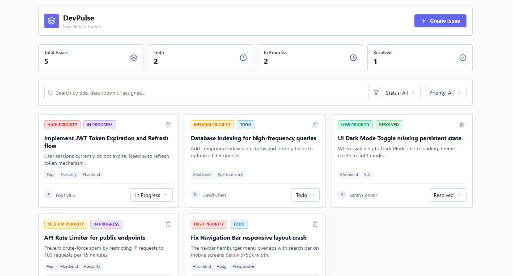

# DevPulse - Issue & Task Tracker

DevPulse is a full-stack web application designed to track, manage, and monitor project issues and tasks. It features a modern, responsive dashboard with real-time statistics, search/filtering options, and a clean card grid layout for easy task visualization.



---

## Features
- **Interactive Dashboard**: View real-time totals and statuses (Todo, In Progress, Resolved).
- **Advanced Filtering**: Filter issues dynamically by status, priority, or through a text search on title, description, and assignees.
- **Task Management**: Create, update, and permanently delete tasks.
- **Categorization**: Tag support for quick labeling (e.g., `#api`, `#frontend`, `#database`).

---

## Prerequisites
Ensure you have the following installed on your machine:
- **Node.js**: `v18.x` or `v20.x` (LTS recommended)
- **MongoDB**: `v6.0` or higher running locally (default: `mongodb://127.0.0.1:27017/devpulse_db`)

---

## Installation & Setup

Follow these steps to set up and run the application locally.

### 1. Database Configuration
Make sure your local MongoDB service is running:
- **Windows**: Start MongoDB via Services or run `mongod` in your terminal.
- **Mac/Linux**: Run `brew services start mongodb-community` or `sudo systemctl start mongod`.

### 2. Backend Setup
1. Navigate to the `Backend` directory:
   ```bash
   cd Backend
   ```
2. Install the backend dependencies:
   ```bash
   npm install
   ```
3. Configure the environment variables. Ensure a `.env` file exists in the `Backend` root folder with the following keys (a `.env.example` is provided):
   ```env
   PORT=5000
   MONGO_URI=mongodb://127.0.0.1:27017/devpulse_db
   ```
4. Seed the database with the initial sample tasks:
   ```bash
   node seed.js
   ```
5. Start the backend development server:
   ```bash
   npm run dev
   ```
   *The backend server will run on `http://localhost:5000`.*

### 3. Frontend Setup
1. Open a new terminal window and navigate to the `Frontend` directory:
   ```bash
   cd Frontend
   ```
2. Install the frontend dependencies:
   ```bash
   npm install
   ```
3. Start the Vite development server:
   ```bash
   npm run dev
   ```
   *The frontend dev server will launch at `http://localhost:5173`.*

---

## API Endpoints
The backend runs on port `5000` and exposes the following routes:
- `GET /api/issues` - Fetch all issues (supports `status`, `priority`, and `search` query parameters)
- `GET /api/issues/stats` - Fetch total issues and counts grouped by status
- `GET /api/issues/:id` - Fetch details of a single issue
- `POST /api/issues` - Create a new issue
- `PUT /api/issues/:id` - Update an existing issue
- `DELETE /api/issues/:id` - Permanently delete an issue
